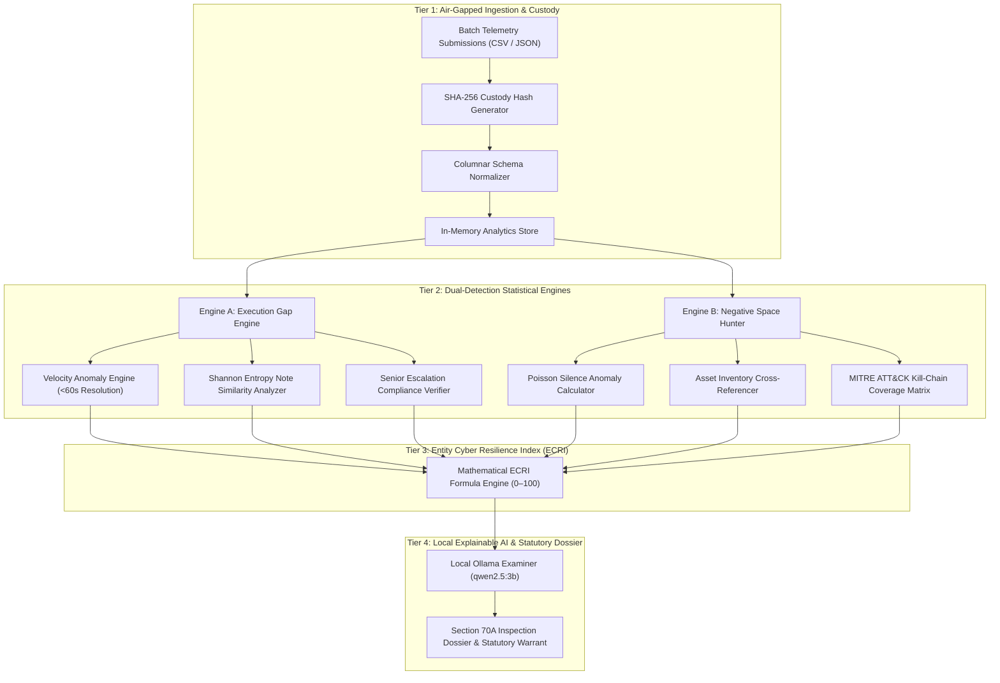

# System Architecture: SAT-SA Platform

**Supervisory Analytics Tool for SOC Assessment (SAT-SA)**  
*National Critical Information Infrastructure Protection Centre (NCIIPC) — Regulatory Compliance Engine under Section 70A, Information Technology Act.*

---

## 1. Architectural Philosophy & Scope Boundaries

In accordance with national cybersecurity directives, NCIIPC does not function as an active SIEM or live packet capture (PCAP) monitoring station. Instead, SAT-SA operates as a **supervisory auditing system** designed to evaluate aggregated, periodic batch telemetry submitted by Critical Sector Entities (CSEs) across Power, Banking, Telecom, Transport, and Defence.

### Core Architectural Guarantees
1. **100% Air-Gapped & Offline Execution:** SAT-SA executes completely within isolated supervisory chambers with zero external network outbound calls, zero cloud dependencies, and zero third-party analytics libraries.
2. **Metadata-Only Schema Ingestion:** Aligns strictly with Section 2 of the statutory mandate—evaluating alert lifecycle metadata, resolution timestamps, investigation notes, and asset IDs without ingesting sensitive payloads or proprietary customer data.
3. **Cryptographic Chain of Custody:** Calculates hardware-accelerated SHA-256 hashes upon file ingestion to ensure legal non-repudiation in regulatory proceedings.

---

## 2. End-to-End System Pipeline

---

## 3. Deep-Dive: Processing Tiers

### Tier 1: Ingestion & Cryptographic Custody
* **File Input:** Supports CSV and JSON dumps of alert logs, case management tickets, escalation manifests, and asset inventories.
* **Hash Computation:** Runs `crypto.subtle.digest('SHA-256')` directly over the byte stream. The resulting 64-character hexadecimal digest binds the audit report permanently to the submitted artifact.
* **Columnar Normalization:** Flattens diverse SOC vendor schemas (Splunk, Elastic, Sentinel, QRadar) into standard internal tuples:
  $$\langle \text{AlertID}, \text{AssetID}, \text{Severity}, \text{CreatedAt}, \text{ClosedAt}, \text{TriageDuration}, \text{AnalystNote}, \text{EscalatedTier} \rangle$$

---

### Tier 2: Dual-Detection Statistical Engines

#### Engine A: Execution Gap Engine
Detects fraudulent, lazy, or negligent alert management practices that create severe operational exposure:
1. **SLA Speed Metric Gaming (Velocity Anomaly):**  
   Evaluates alert triage speed against realistic human forensic limits. Alerts resolved in $t < 60\text{ seconds}$ on Tier-1 assets receive a critical penalty:
   $$Z_{velocity} = \frac{t - \mu_{cohort}}{\sigma_{cohort}}$$
2. **Investigation Note Cloning (Shannon Entropy):**  
   Measures textual diversity and semantic replication across analyst remarks. When multiple analysts submit identical strings (*"Host examined, verified benign false positive"*), entropy drops toward zero, flagging automated template rubber-stamping.
3. **Escalation Hierarchy Bypass:**  
   Verifies whether Critical/High alerts on designated Tier-1 assets were escalated to Tier-2 incident response leads or the CISO, or dismissed at L1 entry-level without review.

#### Engine B: Negative Space Hunter
Detects the most dangerous cyber threats: silent critical systems that should be generating logs but produce nothing:
1. **Poisson Silence Probability:**  
   Given an asset's baseline historical arrival rate $\lambda$ (alerts/day), the probability of observing zero alerts ($k=0$) over an observation period $T$ is:
   $$P(k = 0) = e^{-\lambda T}$$
   When $P(k=0) < 10^{-6}$ for critical nodes (e.g., Core Banking Oracle RAC DBs, SCADA Substation RTUs), SAT-SA flags a severe telemetry void.
2. **MITRE ATT&CK Matrix Void Analysis:**  
   Maps alert categories to the MITRE ATT&CK kill-chain. An entity capturing thousands of initial phishing alerts but **zero** Lateral Movement or Credential Access alerts is flagged for internal sensor blindness.

---

### Tier 3: Entity Cyber Resilience Index (ECRI)

ECRI is a composite 0–100 benchmark metric derived from multi-attribute operational risk functions:

$$\text{ECRI} = \max\left(0, 100 - \left[ w_v \cdot \mathcal{P}_{velocity} + w_c \cdot \mathcal{P}_{clone} + w_e \cdot \mathcal{P}_{escalate} + w_s \cdot \mathcal{P}_{silence} \right]\right)$$

*Where:*
* $\mathcal{P}_{velocity}$: Percentage of alerts resolved under 60 seconds.
* $\mathcal{P}_{clone}$: Percentage of tickets containing identical duplicate closure notes.
* $\mathcal{P}_{escalate}$: Rate of senior escalation avoidance on Tier-1 assets.
* $\mathcal{P}_{silence}$: Ratio of silent critical nodes to total registered infrastructure.
* **Thresholds:**
  * $\ge 80$: **Exemplary / Compliant**
  * $60 - 79$: **Supervisory Watchlist** (Elevated audit frequency)
  * $< 60$: **Critical Deficiency** (Immediate on-site statutory warrant issued)

---

### Tier 4: Explainable AI (XAI) & Regulatory Enforcement

* **Local Ollama Reasoner:** Integrates with local lightweight quantized models (`qwen2.5:3b`, `qwen2.5:1.5b`) via a low-latency loopback daemon (`server.py`).
* **Section 70A Statutory Inquiries:** Transforms statistical anomaly vectors into formal legal findings and precise questions for CISO depositions.
* **Supervisory Dossier:** Automatically generates an official NCIIPC Supervisory Audit Dossier and On-Site Inspection Warrant containing cryptographic custody proofs, velocity histograms, negative space logs, and CISO interrogatories.
