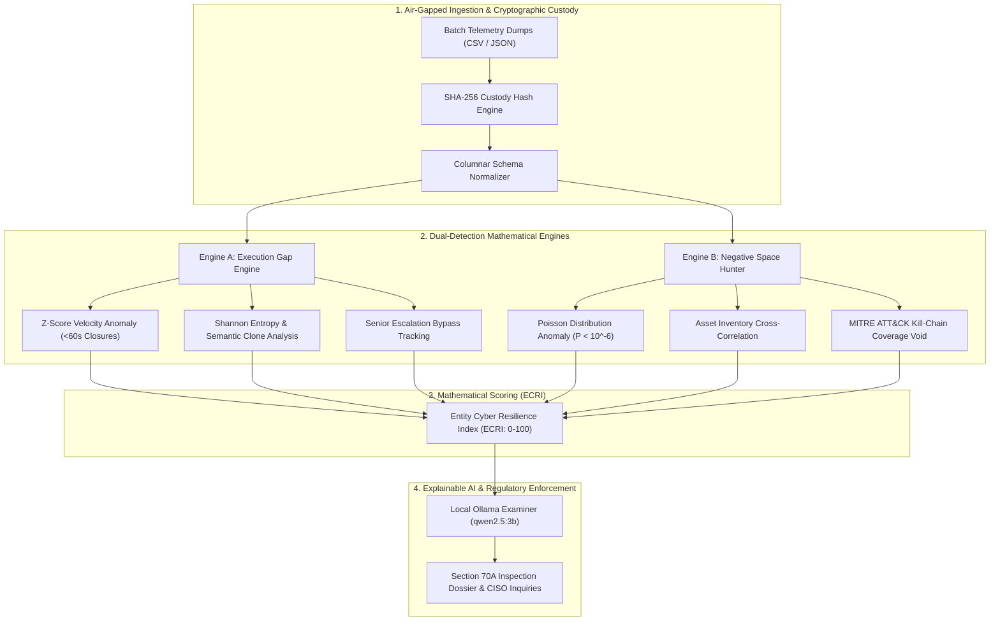

# SAT-SA: Supervisory Analytics Tool for SOC Assessment

[](https://nciipc.gov.in)
[](https://www.meity.gov.in)
[](https://github.com)
[-black?style=flat-square)](https://ollama.com)

**SAT-SA (Supervisory Analytics Tool for SOC Assessment)** is an offline, air-gapped supervisory audit platform engineered for the **National Critical Information Infrastructure Protection Centre (NCIIPC)** under Section 70A of the Information Technology Act.

---

## 1. Executive Summary & Problem Context

In national cybersecurity governance, NCIIPC does **not** operate as a live Security Operations Center (SOC) or SIEM; raw packet capture (PCAP) streams and live telemetry feeds are explicitly out of scope. Instead, NCIIPC exercises supervisory oversight by conducting periodic, statutory audits of aggregated batch telemetry and ticket dumps submitted by designated **Critical Sector Entities (CSEs)** across Banking, Power, Transport, Telecom, and Strategic Defence.

Traditional SOC auditing fails because entities can manipulate surface metrics:
1. **Execution Gaps:** SOC analysts artificially "game" Service Level Agreements (SLAs) by summarily closing high-severity intrusion alerts in under 60 seconds with duplicate, copy-pasted boilerplate remarks (*"verified benign false positive"*), bypassing mandatory L2 and CISO escalations.
2. **Negative Space:** Audits historically focus only on alerts that exist. The most catastrophic critical infrastructure breaches occur where systems are completely silent—such as Tier-1 Core Banking DBs or SCADA RTUs that generate **zero telemetry over 90 days** due to misconfigured log shippers, disabled sensors, or adversary suppression (*"the dog that didn't bark"*).

SAT-SA provides automated dual detection, mathematical resilience scoring (ECRI), and explainable local AI reasoning to identify operational negligence and generate statutory inspection warrants.

---

## 2. System Architecture & Dual-Detection Pipeline

SAT-SA operates on an air-gapped, four-tier architecture designed to process hundreds of thousands of alert records locally without external internet connectivity or cloud dependencies:



### Mathematical Foundations

#### 1. Execution Gap: Velocity Anomaly ($Z_{velocity}$)
Measures deviation in alert triage duration ($t$) compared to national peer cohort baselines ($\mu_{cohort}, \sigma_{cohort}$):
$$Z_{velocity} = \frac{t - \mu_{cohort}}{\sigma_{cohort}}$$
Alerts closed with $t < 60\text{ seconds}$ on Tier-1 assets receive maximum execution penalty scores.

#### 2. Negative Space: Poisson Silence Probability ($P_{silent}$)
Given an asset historical arrival rate of $\lambda$ alerts per month, the probability of zero alerts occurring over time window $T$ is:
$$P(k = 0) = e^{-\lambda T}$$
When $P(k=0) < 10^{-6}$, the silence is classified as a critical logging blindspot or adversarial sensor suppression rather than operational health.

#### 3. Entity Cyber Resilience Index (ECRI)
A composite $0-100$ score balancing execution rigour against telemetry completeness:
$$\text{ECRI} = 100 - \left( w_1 \cdot \text{Gap}_{velocity} + w_2 \cdot \text{Clone}_{template} + w_3 \cdot \text{Bypass}_{escalate} + w_4 \cdot \text{Void}_{negative} \right)$$

---

## 3. Repository Contents

```
SAT-SA/
├── index.html                   # High-performance single-page supervisory console
├── server.py                    # Local air-gapped server & Ollama reverse proxy
├── generate_rich_datasets.py    # Multi-sector production benchmark telemetry generator
├── problem statement.md         # Official NCIIPC PS #26157 specifications
├── IMPLEMENTATION_PLAN.md       # Full engineering specifications and formulas
├── PRESENTATION_SLIDES.md       # Formal 4-slide regulatory presentation deck
├── .gitignore                   # Production repository exclusions
└── data/
    ├── large_datasets/          # Multi-hundred row sector validation batches
    │   ├── sbi_banking_large_dataset.csv       # 140 Banking alerts (Silent Core DBs)
    │   ├── powergrid_scada_large_dataset.csv   # 150 SCADA alerts (83% SLA speed gaming)
    │   ├── delhi_metro_transit_dataset.json    # 120 Transit tickets (MITRE void)
    │   └── drdo_strategic_defence_dataset.json # 100 Defence alerts (Forensic benchmark)
    └── sample_cses/             # Baseline entity alert logs and asset inventories
```

---

## 4. Complete Setup & Installation Guide

SAT-SA is engineered to operate 100% offline in air-gapped supervisory chambers. Follow these steps to clone, configure, and execute the system.

### Prerequisites

Ensure the following are installed on your host machine:
* **Python 3.10+** ([python.org](https://www.python.org))
* **Git** ([git-scm.com](https://git-scm.com))
* **Ollama** ([ollama.com](https://ollama.com)) for local, offline LLM inference

---

### Step 1: Clone the Repository

```bash
git clone https://github.com/<your-organization>/SAT-SA.git
cd SAT-SA
```

---

### Step 2: Configure the Local Air-Gapped AI Model

SAT-SA integrates with local Ollama instances to eliminate cloud transmission of classified critical infrastructure telemetry:

```bash
# Pull the recommended local reasoning model (compact, high-speed on CPU)
ollama pull qwen2.5:3b

# Start the Ollama daemon (if not already running as a system service)
ollama serve
```

---

### Step 3: Launch the SAT-SA Supervisory Daemon

Run the built-in local server, which hosts the client console and provides an authenticated local proxy to Ollama:

```bash
python server.py
```

*Output:*
```text
================================================================
   SAT-SA: Supervisory Analytics Tool for SOC Assessment
   NCIIPC Operational Auditing Console (Air-Gapped)
================================================================
 Server Running: http://localhost:8080
 Ollama Endpoint: http://localhost:11434
 Status: Online and Ready
================================================================
```

---

### Step 4: Open the Supervisory Console

Open your web browser and navigate to:
```
http://localhost:8080
```

---

## 5. Operational Workflow & Execution Guide

### Phase 1: Batch Telemetry Ingestion
1. Navigate to **01. Ingestion Console**.
2. Select the target Critical Sector Entity (e.g., *State Bank of India*, *National Power Grid*, *Delhi Metro*, or *DRDO*).
3. Select the submission category under Section 2 of the problem statement.
4. Drag & drop any CSV or JSON telemetry batch from `data/large_datasets/` (or click one of the pre-loaded benchmark buttons).
5. The console automatically calculates and verifies the SHA-256 cryptographic custody hash.

### Phase 2: Dual Detection Assessment
Once ingested, SAT-SA executes the columnar parsing pipeline:
* **02. Executive Dashboard:** Evaluates the Entity Cyber Resilience Index (ECRI), triage velocity distributions, and domain-specific Operational Assurance Deficit breakdowns.
* **03. Execution Gaps Engine:** Surfaces alerts closed under 60 seconds, identical semantic template notes, and bypassed senior escalation workflows.
* **04. Negative Space Hunter:** Correlates alert streams against registered asset inventories to isolate silent Tier-1 infrastructure and MITRE ATT&CK coverage voids.

### Phase 3: Local Explainable AI (XAI) Supervisory Reasoner
* Navigate to **05. Ollama AI Examiner**.
* Select the operational case evidence to review.
* Click **▶ Run Local Ollama Inference (qwen2.5:3b)**.
* The local model synthesizes a formal regulatory finding citing Section 70A violations and produces pointed, statutory interview questions for the entity CISO.

### Phase 4: Regulatory Inspection Dossier
* Click **Generate Audit Dossier** on the dashboard.
* An official NCIIPC Supervisory Audit Dossier and On-Site Inspection Warrant is formatted with all computed mathematical evidence, ready for regulatory issuance.

---

## 6. Security, Compliance & Air-Gap Verification

* **Zero Cloud Dependency:** Operates without external CDNs, external web fonts, or remote APIs.
* **Cryptographic Custody:** Every submitted file is timestamped and hashed with SHA-256 before memory ingestion to ensure non-repudiation in regulatory proceedings.
* **Section 2 Alignment:** Strictly enforces metadata-only ingestion (Alert ID, Asset ID, Triage Duration, Analyst Closure Remark, Escalation Tier), completely avoiding raw payload or network PCAP data.

---

## 7. License & Regulatory Notice

This software is developed in alignment with the operational specifications of the **National Critical Information Infrastructure Protection Centre (NCIIPC)** and the provisions of **Section 70A of the Information Technology Act, 2000**.
